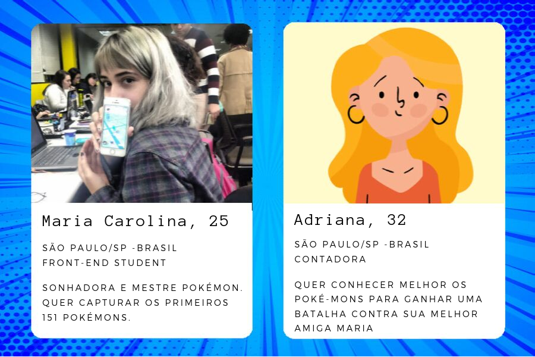
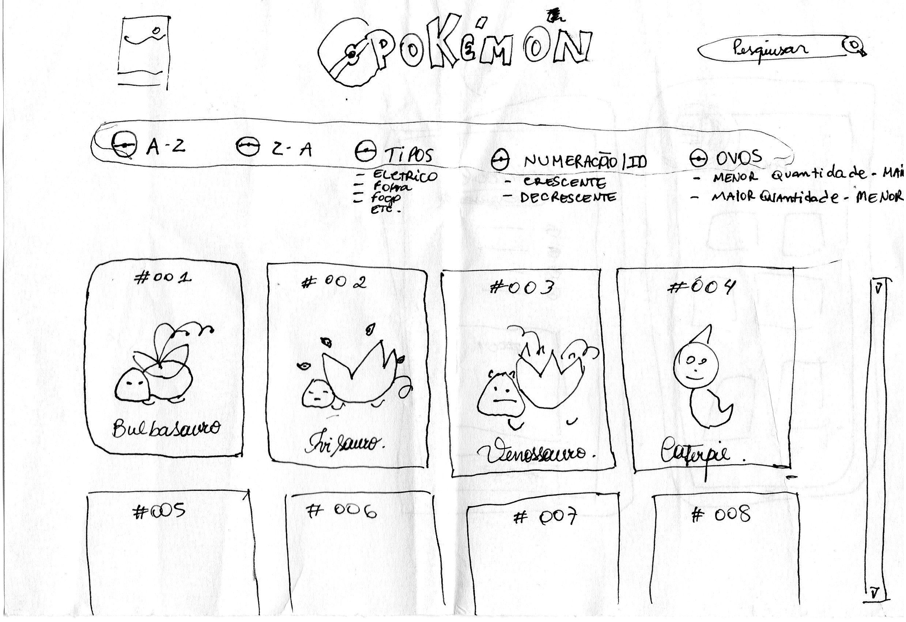
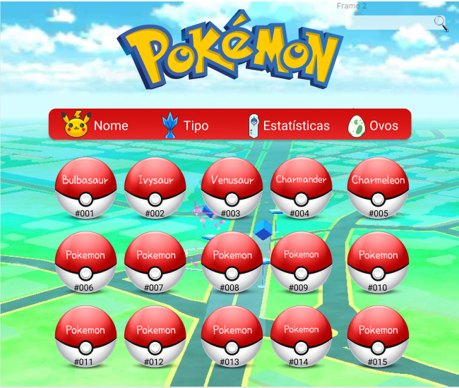

# Pokélist

## Índice

* [1. Projeto Pokélist](#1-pokélist)
* [2. Usuários](#2-usuários)
* [3. História  de Usuários](#3-histórias-de-usuários)
* [4. Desenho de Interface do Usuário](#4-desenho-de-interface-do-usuário)
* [5. Testes de usabilidade](#5-testes-de-usabilidade)
* [6. Considerações finais](#6-considerações-finais)

***

## 1. Pokélist

Pokémon GO é um jogo para smartphones criado pela empresa Niantic, Inc.
Lançado em 2016, Pokémon Go é um jogo de realidade aumentada onde o usuário tem
a experiência de se tornar um mestre Pokémon, podendo caçar, evoluir e batalhar
com seus Pokémons.
Neste projeto misturamos referências do mundo pokémon como um todo, com a interface
do jogo. Buscamos trazer as informações dentro de Cards Pokémons, que são queridos
até hoje por fãs em todos os lugares do mundo.

E porquê Pokémon GO? 
No mês de agosto de 2019 o jogo voltou a ser o free to play mais lucrativo do
mundo, faturando us$176 milhões e passando o marco de 1 Bilhão de downloads.
O projeto Pokélist veio com o intuito de resolver alguns problemas que o jogador
de Pokémon GO tem, como por exemplo descobrir quais os pokémons vem em cada tipo 
de Ovo, e assim facilitar estratégias de batalha e organização da pokedéx do jogador.

## 2. Usuários

## 3. Histórias de Usuários

Maria:

Maria tem um grande sonho que é ser uma grande mestre pokémon, para isso ela precisa
saber quais são os pokémons que vem em cada tipo de Ovo, os de 2 km, 5 km, 10 e km e 
quais são os pokémons que não vem em ovos. Assim quando ela encontrar um ovo pokémon já
pode planejar a organização de sua pokedéx e também saber se o Ovo que ela acabou de 
pegar pode ser um Pokémon repetido que já não tem mais interesse, dessa maneira ela
passa mais tempo focada nos pokémons de seu interesse.
Além de saber quais pokémons vem em cada tipo de Ovo, Maria gostaria de saber qual a 
porcentagem de pokémons vem em cada Ovo, e qual a porcentagem de pokémons que ela vai
conseguir somente por evolução.

Adriana:

Adriana começou a jogar Pokémon GO por pura insistência de sua amiga Maria, agora
ela já está viciada nesse novo mundo e quer acompanhar a amiga. Como Adriana joga a 
pouco tempo ela precisa saber os nomes dos Pokémons e visualizar seus tipos e fra-
quezas, assim ela vai conseguir traçar estratégias para vencer no campo de batalha
e se tornar cada vez mais forte. 
Outro necessidade que Adriana tem é saber quais pokémons ela vai conseguir evoluir
mais rápido, no jogo ela consegue evoluir seus pokémons com candies, então ela vai 
começar a evoluir os que precisam de menos candies e aos poucos vai juntando candies
para os que precisam de mais.

Como o projeto Pokélist pode ajudar essas usuárias?

Criamos uma interface que permite as usuárias:

* Visualizar quais pokémons vem em cada tipo de Ovo;
* Ordenar os pokémons por Nome em ordem crescente e decrescente;
* Ordenar os pokémons por quantos candies para evoluir precisam;
* Visualizar estatísticas de porcentagem Pokémon por Ovo;
* Buscar um Pokémon por nome na barra de busca;
* Visualizar Pokémons em Cards, com as informações essênciais a cada jogador: nº Pokémon,
tipo, fraquezas, em que ovo vem e quantos candies são necessários para evoluir.

Além disso trazemos a sensação nostalgica de brincar com Cards Pokémons, girando os cards
ao passar com o mouse por cima deles.
Ambas usuárias estão contentes com o resultado e já informaram que irão utilizar o site
toda vez que tiverem uma dúvida com relação aos Pokémons e como vão seguir com suas estra-
tégias no jogo.

## 4. Desenho de interface do usuário

#### Protótipo de baixa fidelidade - Papel

Tivemos dois desenhos de interface de usuário, a primeira no papel onde colocamos algumas
opções antes de fazer a história de usuário, conforme fizemos a pesquisa posteriormente 
vimos que algumas dessas opções eram na verdade dispensavéis e que não tinham interesse 
para nossas usuárias.

#### Protótipo de baixa fidelidade - Digital

Depois do protótipo de papel fizemos uma no Figma, mas somente para visualização da interface.
Nessa segunda pensamos em mostrar as pokebolas com nomes e ID dos pokémos e somente mostrar os
dados após clicar nas pokébolas, nesse segundo protótipo também já haviamos entrevistados usuá-
rias e definido que aspectos seriam interessantes de serem visualizados.

Decidimos porém que não era visualmente agradável uma interface somente com as pokebolas, e que
o card traria uma sensação nostalgica, tendo em vista que também existe um jogo Pokémon em cards.

## 5. Testes de usabilidade

Durante a criação do projeto fizemos testes de usabilidade com as usuárias, e algumas alterações 
foram feitas durante o processo.

A dificuldade de deixar claro a ordenação de candies foi grande. Da primeira vez a opção 
estava com o nome de "Candies" e o dropdawn dessa opção como "maior-menor", "menor-maior"
e "sem evolução, as usuárias disseram que estava confuso e que não entenderam que se tratava de
ordenar os pokémos por candies para evoluir, modificamos então essa opção para "Candies para 
Evoluir" e o dropdawn para "12-400", "400 -12" e "sem evolução", passamos novamente para as 
usuárias e tivemos a mesma resposta, estava confuso e nada claro que era sobre Ordenar. Perguntamos
se ao colocarmos "Ordenar por Candies" ficaria claro sobre o que se tratava, tivemos uma resposta
positiva e assim o fizemos, passamos novamente pelo teste de uso e dessa vez ficamos felizes pois 
ficou claro para as usuárias.

Outro ponto que foi levantado durante os testes foi a necessidade de implementação de um botão para
voltar ao topo da página, a quantidade de pokémons é grande e após rolar muitos cards, para voltar a
ter acesso ao menu as usuárias tinham que rolar todo o site de volta. Então colocamos um botão no canto
inferior direito para facilitar esse acesso e resolvemos este problema.

Com relação as outras partes do projeto tivemos ótimas respostas das usuárias, disseram ser de fácil
usabilidade e elogiaram o design da interface, as informações serem dispostas em cards foi outro ponto
que as usuárias gostaram, por lembrar um jogo da infância.

## 6. Considerações finais

Esse projeto foi desenvolvido em dupla por Andreza Amorim e Jackeline Mattar como parte do Bootcamp
<Laboratória>, a fim de desenvolver a prática e estudo de Arrays e Objetos em JavaScript, além da mani-
pulação de dados de um data-base.
Agradecemos aos nossos mentores, toda equipe Laboratória e a imensa ajuda que recebemos de nossas amigas
de turma. Juntas somos mais fortes! 